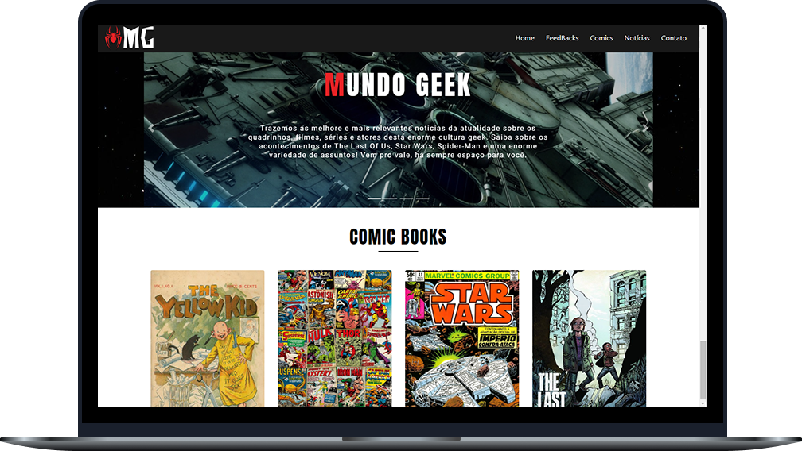

# 💻 Meu Projeto
 Durante a capacitação de tecnologias da byron.solutions aprendemos sobre o framework Bootstrap 4, quais são suas ferramentas e como utilizá-las. Para a conclusão do curso foi nos passado a tarefa de criar nosso próprio site, utilizando todo o aprendizado contido no decorrer da capacitação.

**Página principal do site:**

  

**Tecnologias utilizadas:**
 - Html
- Css
- Javascript (Jquery)
- Bootstrap 4

**O que foi aplicado:**
 - Carousel
 - Cards
 - Parallax
 - Media Objects
 - Scroll Animation

**Feedback:**
 
A capacitação foi excelente, consegui criar um site responsivo utilizando tudo que foi ensinado nos cursos dispostos pela byron. Estou satisfeita com o resultado e em como fomos bem recebidos pela EJ, com certeza procurarei aprimorar o que foi ensinado, buscando sempre melhorar e compartilhar o que foi aprendido.

